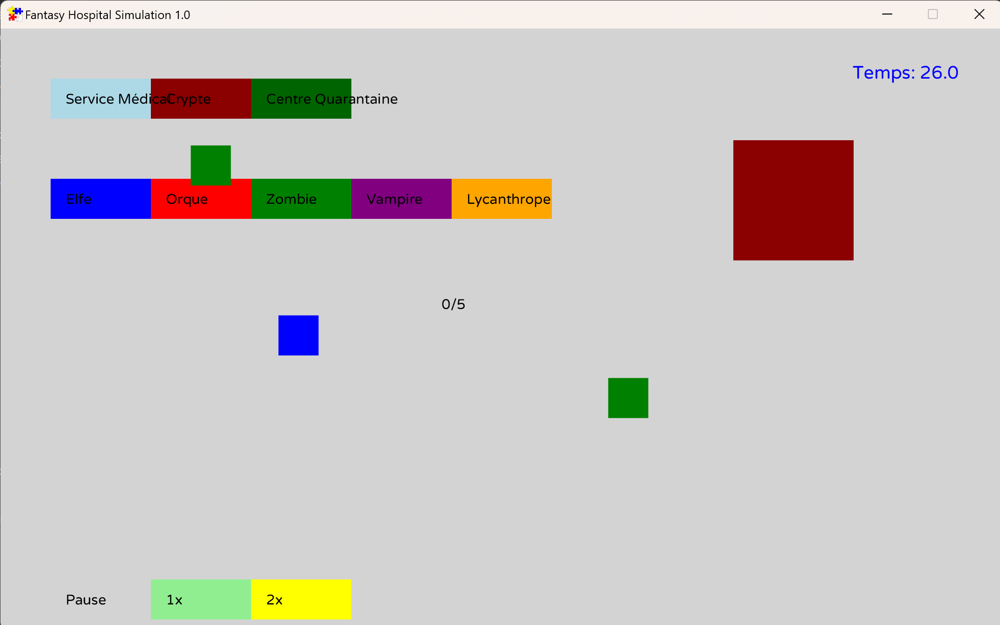

# Fantasy Hospital

## Description
**Fantasy Hospital** est une application de simulation d’hôpital fantastique développée en Java. L’objectif est de gérer un hôpital peuplé de créatures mythiques (elfes, orques, zombies, vampires, etc.) en les soignant et en maintenant un équilibre entre les ressources et leur état émotionnel




---

## Fonctionnalités
### 1. Gestion des Créatures
- **Types de créatures** : Elfes, Nains, Orques, Zombies, Vampires, Lycanthropes, Homme-bêtes, Reptiliens
- **Caractéristiques** :
    - Nom, sexe, poids, taille, âge, moral, liste de maladies
- **Comportements** :
    - Attendre, hurler, s’emporter, tomber malade, être soignée, trépasser.
    - Actions spécifiques par type de créature (ex. contamination, régénération, démoralisation)

### 2. Gestion des Maladies
- **Types de maladies** :
    - Maladie débilitante chronique (MDC), Syndrome FOMO, Dépendance aux réseaux sociaux (DRS), Porphyrie érythropoïétique congénitale (PEC), Zoopathie paraphrénique lycanthropique (ZPL), etc
- **Caractéristiques** :
    - Nom, niveau actuel, niveau maximum (avant trépas)
- **Comportements** :
    - Progression, diminution, létalité

### 3. Services Médicaux
- **Types de services** :
    - Standard, Centres de quarantaine (pour créatures contagieuses), Cryptes (pour créatures régénérantes)
- **Caractéristiques** :
    - Nom, capacité, budget, caractéristiques spécifiques (isolation, ventilation, température)
- **Fonctionnalités** :
    - Ajouter/enlever des créatures, soigner, réviser le budget

### 4. Médecins
- **Caractéristiques** :
    - Nom, sexe, âge.
- **Fonctionnalités** :
    - Examiner un service médical
    - Soigner les créatures
    - Transférer des créatures entre services
    - Réviser le budget d’un service

### 5. Simulation et Gestion de l’Hôpital
- **Hôpital Fantastique** :
    - Gestion des services médicaux et des médecins
    - Affichage des créatures présentes dans tous les services
- **Simulation temporelle** :
    - Évolution aléatoire des états des créatures et des services médicaux
    - Intervention limitée de l’utilisateur pour équilibrer l’hôpital

---

## Prérequis
- **Java** : Version 11 ou supérieure.
- **IDE recommandé** : IntelliJ IDEA, Eclipse, ou VS Code.

---

## Installation
1. Clonez le projet depuis le dépôt GitHub :
   ```bash
   git clone https://github.com/username/fantasy-hospital.git
